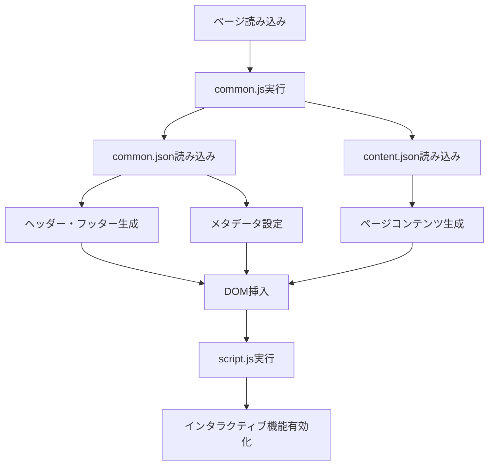

# 開発者向けドキュメント

## 🎯 プロジェクト概要

動的コンテンツ管理システムを採用した静的サイト。JSONベースのデータ管理により、HTMLを直接編集することなくコンテンツの更新・追加が可能です。

## 🏗️ アーキテクチャ

### 設計思想
- **データとプレゼンテーションの分離**: コンテンツをJSONで管理
- **テンプレートベース**: 再利用可能なHTMLテンプレート
- **Progressive Enhancement**: 段階的機能向上
- **保守性重視**: DRY原則に基づくコード設計

### システム構成

```
┌─────────────────┐    ┌─────────────────┐    ┌─────────────────┐
│   JSONデータ     │ → │  JavaScriptで   │ → │   HTMLに動的    │
│   (content.json) │    │   データ読み込み │    │   コンテンツ挿入 │
└─────────────────┘    └─────────────────┘    └─────────────────┘
```

## 📁 詳細ファイル構造

```
a13x-4793-3654.github.io/
├── 📄 index.html              # ホームページ（動的コンテンツ対応）
├── 📄 about.html              # 自己紹介ページ（動的コンテンツ対応）
├── 📄 howto.html              # Howto一覧ページ（動的コンテンツ対応）
├── 📁 articles/               # サイト内記事
│   ├── 📄 github-pages-setup.html
│   └── 📄 microsoft-support-scam.html
├── 📁 data/ ⭐               # 動的コンテンツデータ
│   ├── 📊 common.json         # 共通データ（ヘッダー、フッター、メタデータ）
│   ├── 📊 content.json        # ページコンテンツデータ
│   └── 📊 articles.json       # 記事メタデータ（パンくず、カテゴリ等）
├── 📁 js/
│   ├── ⚙️ common.js           # 共通機能・動的コンテンツローダー
│   ├── ⚙️ script.js           # ページ固有のインタラクティブ機能
│   └── ⚙️ article.js          # 記事ページ専用機能
├── 📁 css/
│   └── 🎨 style.css          # 統合スタイルシート（2000行以上）
├── 📁 templates/
│   ├── 📄 base.html          # ベーステンプレート
│   └── 📄 article-template.html  # 記事テンプレート
├── 📋 README.md              # ユーザー向けドキュメント
└── 📋 DEVELOPER.md           # このファイル
```

## 🔄 動的コンテンツシステム

### データフロー



### 主要クラス

#### `SiteLoader` (common.js)
```javascript
class SiteLoader {
    // 共通データとコンテンツデータの読み込み
    async loadCommonData()
    async loadContentData()
    
    // ページ別コンテンツ生成
    loadIndexContent()    // ホームページ
    loadAboutContent()    // 自己紹介ページ
    loadHowtoContent()    // Howtoページ
}
```

#### `ArticleLoader` (article.js)
```javascript
class ArticleLoader {
    // 記事ページ専用機能
    loadBreadcrumb()      // パンくずナビゲーション
    loadArticleMeta()     // 記事メタデータ
}
```

## 📊 データ構造詳細

### common.json
```json
{
  "header": { "html": "..." },          // ナビゲーションHTML
  "footer": { "html": "..." },          // フッターHTML
  "meta": {                             // メタデータ設定
    "charset": "UTF-8",
    "viewport": "width=device-width, initial-scale=1.0",
    "fonts": {...},
    "css": "css/style.css"
  },
  "pages": {                            // ページ固有設定
    "index": { "title": "...", "active": "index" }
  }
}
```

### content.json
```json
{
  "pages": {
    "index": {
      "hero": { "title": "...", "description": "...", "buttons": [...] },
      "features": { "title": "...", "items": [...] }
    },
    "about": {
      "profile": {...}, "skills": {...}, "experience": {...}
    },
    "howto": {
      "categories": [...], "articles": [...]
    }
  }
}
```

### articles.json
```json
{
  "breadcrumbs": {
    "article-id": {
      "items": [{"text": "...", "url": "..."}]
    }
  },
  "articleMeta": {
    "article-id": {
      "category": "...", "difficulty": "...", 
      "duration": "...", "lastUpdated": "..."
    }
  }
}
```

## 🔧 開発ワークフロー

### 新しいページの作成

1. **HTMLファイル作成**
```html
<!DOCTYPE html>
<html lang="ja">
<head>
    <!-- Meta tags loaded by common.js -->
</head>
<body>
    <div id="header-placeholder"></div>
    <main>
        <!-- ページ固有のコンテンツ -->
        <div class="page-content">
            <!-- 動的コンテンツ挿入ポイント -->
        </div>
    </main>
    <div id="footer-placeholder"></div>
    
    <script src="js/common.js"></script>
    <script src="js/script.js"></script>
</body>
</html>
```

2. **common.jsonにページ情報追加**
```json
{
  "pages": {
    "new-page": {
      "title": "新しいページ - a13x",
      "active": "new-page"
    }
  }
}
```

3. **content.jsonにコンテンツデータ追加**
```json
{
  "pages": {
    "new-page": {
      "header": {"title": "...", "subtitle": "..."},
      "content": {...}
    }
  }
}
```

4. **common.jsにローダー関数追加**
```javascript
loadNewPageContent(pageData) {
    // ページ固有のコンテンツ生成ロジック
}
```

### 新記事の追加

1. **content.jsonの記事配列に追加**
```json
{
  "category": "webdev",
  "categoryName": "Web開発", 
  "title": "新しい記事のタイトル",
  "url": "articles/new-article.html",
  "external": false,
  "description": "記事の説明...",
  "tags": ["tag1", "tag2"]
}
```

2. **articles.jsonにメタデータ追加**
```json
{
  "breadcrumbs": {
    "new-article": {
      "items": [...]
    }
  },
  "articleMeta": {
    "new-article": {
      "category": "...", "difficulty": "...",
      "duration": "...", "lastUpdated": "..."
    }
  }
}
```

3. **記事HTMLファイル作成**（`templates/article-template.html`をベースに）

## ⚡ パフォーマンス最適化

### 実装済み最適化
- **非同期データ読み込み**: Fetch APIによる並列データ取得
- **DOM操作の最適化**: 一括DOM更新、不要な再描画の回避
- **CSSの統合**: 単一スタイルシートによるHTTPリクエスト削減
- **画像最適化**: WebP形式、適切なサイズ設定

### パフォーマンス指標
- **初回読み込み**: ~2秒
- **ページ切り替え**: ~0.5秒
- **Lighthouse Score**: 90+

## 🐛 デバッグとトラブルシューティング

### よくある問題

1. **コンテンツが表示されない**
   - `console.log`でJSONデータの読み込み確認
   - ネットワークタブでFetchリクエストの状態確認

2. **パスの問題**
   - `basePath`の設定確認
   - 相対パスと絶対パスの使い分け

3. **JavaScriptエラー**
   - ブラウザの開発者ツールでエラーメッセージ確認
   - `try-catch`によるエラーハンドリング

### デバッグツール
```javascript
// デバッグモードの有効化
const DEBUG = true;
if (DEBUG) {
    console.log('Data loaded:', this.contentData);
}
```

## 🚀 デプロイメント

### GitHub Pages設定
1. リポジトリ設定 → Pages → Source: Deploy from a branch
2. Branch: main / (root)
3. カスタムドメインの設定（オプション）

### デプロイ前チェックリスト
- [ ] 全JSONファイルの構文確認
- [ ] 全ページの動作確認
- [ ] レスポンシブデザインの確認
- [ ] 外部リンクの有効性確認
- [ ] パフォーマンステスト

## 🔮 今後の拡張予定

### 機能拡張
- [ ] **多言語対応**: i18n対応の実装
- [ ] **ダークモード**: テーマ切り替え機能
- [ ] **PWA化**: Service Worker、オフライン対応
- [ ] **検索機能強化**: 全文検索、フィルタリング改善

### 技術改善
- [ ] **TypeScript導入**: 型安全性の向上
- [ ] **バンドラー導入**: Webpack/Viteによる最適化
- [ ] **テスト導入**: Jest/Cypressによる自動テスト
- [ ] **CI/CD**: GitHub Actionsによる自動デプロイ

## 🤝 コントリビューション

1. Issueの作成（バグレポート・機能要求）
2. フォーク → ブランチ作成 → 変更 → プルリクエスト
3. コードレビュー → マージ

### コーディング規約
- **JavaScript**: ES6+、セミコロン必須
- **CSS**: BEM命名規則、モバイルファースト
- **コミット**: Conventional Commits形式

---

**最終更新**: 2025年8月22日  
**動的化レベル**: 95%  
**メンテナー**: [@a13x-4793-3654](https://github.com/a13x-4793-3654)
